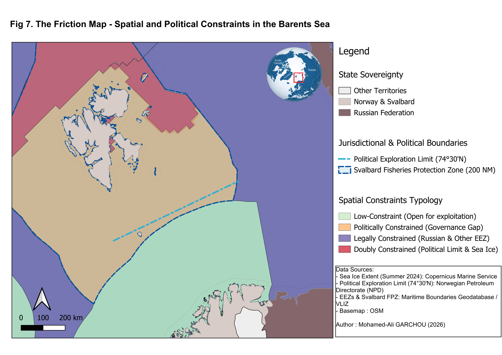
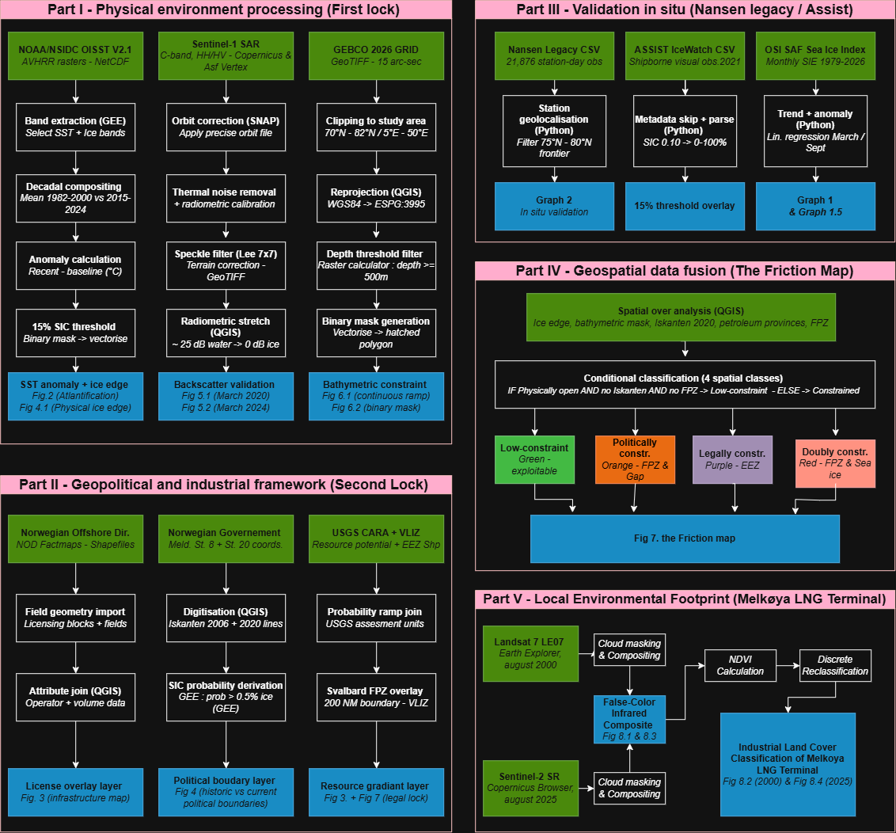

# Norway's Northern Frontier: the Barents Sea "Double Lock"

**Mapping where sea-ice retreat, energy potential and overlapping governance regimes converge in the Barents Sea**

Data, processing scripts and figures for my first-year Master's research dissertation (M1, Geomatics and Spatial Modelling, Aix-Marseille University, ALLSH, 2026), supervised by Pr. Sébastien Gadal (UMR 7300 ESPACE).

**[Download the full dissertation (PDF)](thesis/Thesis_M1_MohamedAli_GARCHOU.pdf)**



---

## In short

The Barents Sea is losing its ice faster than any other Arctic shelf sea. Most of Norway's undiscovered petroleum lies beneath that retreating cover. This project places four sources in a single polar projection (EPSG:3995): Sentinel-1 SAR, NOAA/NSIDC sea-ice records, GEBCO bathymetry and the Norwegian Offshore Directorate's licensing grid. It then maps where these layers disagree.

The result is a **Double Lock**:

1. a domestic political line, the **Iskanten** (marginal-ice-zone boundary, Meld. St. 20, 2019–2020). It no longer matches the ice edge it was drawn to represent;
2. an international legal ambiguity over the **Svalbard continental shelf**, which blocks development across roughly 788,000 km² of seabed.

Climate opens the door. Law and politics keep it shut.

## Key results and the script that reproduces each one

| Result | Value | Script |
|---|---|---|
| NOD Barents licensing grid | 947 blocks, 277,280 km², no block north of 74°30′N (max 74.5004°N) | `scripts/python/03_licensing_grid_stats.py` |
| Share of the Norwegian mainland EEZ (15–40°E, 69–75°N) already gridded | 94.8 % of 292,443 km² | `03_licensing_grid_stats.py` |
| Reconstructed Svalbard Fisheries Protection Zone | 787,902 km², i.e. 2.84 × the licensing grid; 418,180 km² north of 74°30′N | `04_svalbard_fpz.py` |
| Seabed deeper than 500 m in the northern frame | 0.10 % | `02_bathymetry_filter.py` |
| Nansen Legacy in-situ records, 75–80°N, 2017–2021 (21,876 station-days) | 57.1 % below 15 % SIC; 83.8 % in June–September | `07_insitu_validation.py` (data not redistributed) |
| Mean March SIC over the frame, 1990–2024 | slope not significant (p = 0.51, R² = 0.01) | `01_sea_ice_trends.py` |
| Barents extent trends 2000–2024 (NSIDC) | March −0.16, September −0.07 Mkm²/decade | `01_sea_ice_trends.py` |
| SST anomaly 2015–2024 vs 1982–2000 | −0.92 °C to +2.35 °C | `scripts/gee/01_sst_atlantification.js` |
| Melkøya island, vegetation share | 94.4 % (2000) → 52.1 % (2025) | `06_melkoya_landcover.py` |
| Friction Map, four constraint classes | vector layer + areas per class | `05_friction_map.py` |

All values except the NSIDC extent trends, the in-situ statistics and the GEE outputs were re-run from the data in this repository while it was being prepared (see [Reproducibility](#reproducibility)).

## Workflow



| Part | What it does | Tools | Scripts |
|---|---|---|---|
| I. Physical environment (first lock) | SST anomaly, ice edge from the 15 % SIC threshold, Sentinel-1 SAR preprocessing, bathymetric filter | Google Earth Engine, ESA SNAP, QGIS, Python | `gee/01`, `gee/02`, `snap/`, `python/02` |
| II. Geopolitical and industrial framework (second lock) | NOD blocks, fields and licences; Iskanten 2006 / 2020; USGS CARA; VLIZ EEZ; FPZ | QGIS, GEE, Python | `gee/02`, `python/03`, `python/04` |
| III. In-situ validation | Nansen Legacy stations, ASSIST IceWatch ship observations, OSI SAF / NSIDC extent trends | Python | `python/07`, `python/01` |
| IV. Data fusion: the Friction Map | Conditional classification into four constraint classes | Python (GeoPandas), QGIS | `python/05` |
| V. Local footprint: Melkøya LNG terminal | Landsat 7 (2000) vs Sentinel-2 (2025) false colour, NDVI, three-class reclassification | GEE, TerrSet/SNAP, Python | `gee/04`, `python/06` |

The full method is described step by step in [`docs/methodology.md`](docs/methodology.md).

## Repository layout

```
.
├── data/
│   ├── README.md              data dictionary, sources, licences, download links
│   ├── processed/             layers produced for the thesis (tracked)
│   │   ├── vector/            GeoPackages: ice edges, Iskanten, SAR open water, FPZ, Friction Map, NOD layers
│   │   ├── raster/            OISST SST anomaly, March SIC, Melkøya composites and NDVI
│   │   └── tables/            daily March SIC series 1990-2024
│   └── raw/                   third-party downloads (git-ignored; see data/README.md)
├── scripts/
│   ├── gee/                   Google Earth Engine (JavaScript Code Editor)
│   ├── snap/                  Sentinel-1 GRD preprocessing graph + batch runner
│   └── python/                analysis steps 01-07 + config.py
├── figures/                   final thesis figures (author's own plates)
├── thesis/                    full dissertation (PDF)
├── docs/methodology.md
├── environment.yml / requirements.txt
├── CITATION.cff
└── LICENSE, LICENSE-DATA.md
```

## Quick start

```bash
git clone https://github.com/ma-garchou/barents-sea-double-lock.git
cd barents-sea-double-lock
conda env create -f environment.yml
conda activate barents
```

1. Download the third-party inputs listed in [`data/README.md`](data/README.md) into `data/raw/` (EEZ, country boundaries, GEBCO, NSIDC).
2. Run the Python steps in order from the repository root:

```bash
python scripts/python/01_sea_ice_trends.py
python scripts/python/02_bathymetry_filter.py
python scripts/python/03_licensing_grid_stats.py
python scripts/python/04_svalbard_fpz.py
python scripts/python/05_friction_map.py      # needs the output of step 04
python scripts/python/06_melkoya_landcover.py
python scripts/python/07_insitu_validation.py
```

Results go to `outputs/` (git-ignored). Steps 01, 03 and 06 run straight away on the data in this repository.

3. The Earth Engine scripts in `scripts/gee/` are pasted into the [Code Editor](https://code.earthengine.google.com) and export to Google Drive. You need an Earth Engine account.
4. Sentinel-1 preprocessing needs [ESA SNAP](https://step.esa.int/main/download/snap-download/): `python scripts/snap/run_snap_batch.py <folder_of_GRD_zips> <output_folder>`.

## Reproducibility

- The original processing was done interactively in QGIS, SNAP, TerrSet and the Earth Engine Code Editor. The scripts here were written after the defence to make each step repeatable. For every step I could check, they reproduce the thesis figures exactly or within rounding:
  - licensing grid areas and latitude bands, EEZ coverage, FPZ area and its northern share: exact;
  - March SIC regression: exact;
  - deep-water share: 0.10 %, the same as in the thesis. The thesis pixel census used a coarser grid, so the raw pixel counts differ;
  - Melkøya shares: within about 0.5 point with the thresholds in `config.py` (94.5 % / 52.9 % vs 94.4 % / 52.1 %).
- The Earth Engine and SNAP scripts follow the exact datasets, dates and parameters of the thesis. They have not been re-executed end to end for this repository.
- The Svalbard FPZ is a **geometric reconstruction** (200 NM buffer minus neighbouring EEZs), not the gazetted limit.
- The Sentinel-1 evidence rests on two single-month mosaics (March 2020, March 2024), not on a multi-year stack.
- All areas are measured in EPSG:3995, as in the thesis. This projection is conformal, not equal-area. `03_licensing_grid_stats.py` prints an equal-area check alongside.

## The dissertation

The full manuscript is available as a PDF: [`thesis/Thesis_M1_MohamedAli_GARCHOU.pdf`](thesis/Thesis_M1_MohamedAli_GARCHOU.pdf) (English).

## Figures

The final plates are in [`figures/`](figures/). Their file names use the sequential numbers from the manuscript. Figures 3–6, 8–10 and 14 of the thesis are reproduced from third parties (Copernicus Marine, EUMETSAT OSI SAF, Norwegian Offshore Directorate, NSIDC). They are not provided as separate files; they appear only in the PDF, with their credits.

## Main data sources

NOAA OISST v2.1 · NSIDC Sea Ice Index v3 · Copernicus Sentinel-1 (via ASF Vertex) · Sentinel-2 MSI · Landsat 7 ETM+ · GEBCO 2026 Grid · Norwegian Offshore Directorate FactMaps · VLIZ Maritime Boundaries v12 · USGS Circum-Arctic Resource Appraisal · Meld. St. 8 (2005–2006) and Meld. St. 20 (2019–2020). Full references and licences are in [`data/README.md`](data/README.md).

## Citation

> Garchou, M.-A. (2026). *Norway's Northern Frontier: Mapping the Convergence of Sea Ice Retreat, Energy Potential, and Overlapping Governance Regimes in the Barents Sea* [Master's research dissertation (M1), Aix-Marseille University]. https://github.com/ma-garchou/barents-sea-double-lock

A machine-readable citation is available in [`CITATION.cff`](CITATION.cff).

## Licence

- Code: [MIT](LICENSE)
- Data layers and figures produced by the author: [CC BY 4.0](LICENSE-DATA.md)
- Third-party data keep their own licences (see `data/README.md`)

## Author

**Mohamed-Ali Garchou**, Master's student in Geomatics and Spatial Modelling, Aix-Marseille University
[LinkedIn](https://www.linkedin.com/in/mohamed-ali-garchou-796989328) · mohamedali.garchou@gmail.com
